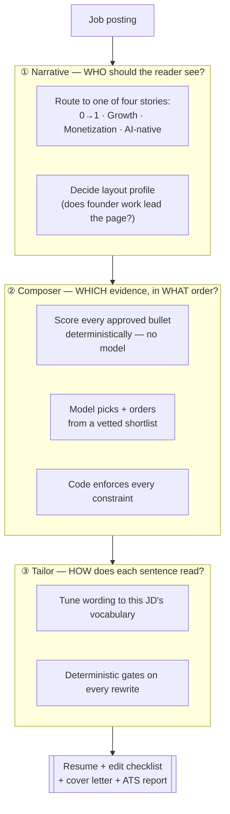

# ApplicationBlitz

**Type:** Automated Python Workflow
**Skill Domain:** CareerOS
**Command:** `python main.py blitz`

## What It Does

Turns a job posting into application materials that argue for *one* impression: a tailored resume, an edit checklist for my canonical doc, a cover letter, and an honest ATS coverage report.

The hard part isn't generating text. It's generating text that is **specific to this role and still true**. Every claim on the page traces back to a bullet I wrote and approved myself — the model tunes wording, it never invents experience.

## The three layers

Earlier versions asked a model to "tailor my resume" in one pass. That produced vocabulary polish: *"built cohort measurement"* → *"defined cohort retention metrics"*. Nothing about the page actually changed.

The fix was to split the job into three decisions that happen in order, because they're different questions and a model is reliable at only one of them.



**① Narrative** decides the single impression before a word is written — the practical principle my career coach drilled: *"for this role, I want the reader to see me as a [X] PM."* It also sets a structural flag: on founder reqs and at AI-native companies, my startup work is promoted out of Education and leads the page.

If a role classifies as genuinely misaligned — platform and infrastructure work, where I have no reps — the workflow **aborts instead of producing a resume**. Forcing a story onto a bad fit is how a resume starts lying.

**② Composer** is the layer the earlier versions didn't have, and the reason they could only reword. Word-level tailoring can't fix a bullet whose *content* is wrong. A deterministic scorer ranks every approved bullet against the routed narrative and the live JD; the model then picks and orders from that shortlist with a stated reason per pick; then code enforces the constraints the model might violate — unknown IDs, duplicates, pinned credentials, per-company line bounds, total page budget, reverse-chronological order.

**③ Tailor** tunes each selected sentence to the posting's vocabulary inside a hard character budget, so bullets keep their two-line shape at my real font size and margins.

## The bullet bank

All three layers read from one file: a bank of every bullet I've written, each tagged with themes, a strength rating, its **protected facts**, and its provenance.

- **Entries I haven't approved are invisible.** Drafts cannot reach a resume.
- **Protected facts must survive verbatim.** A rewrite that drops or alters `$600K`, `9 markets`, or `18 months` is rejected.
- **Canonical facts settle conflicts.** When my resume and my interview prep disagreed on a number, the bank records the winner and what it supersedes — so the resume and the interview say the same thing. A figure that changes between the two is the exact failure the gates exist to prevent.

## Gates: a bad model pass cannot make the resume worse

Every rewrite passes deterministic Python before it reaches the page:

| Gate | Rejects |
|------|---------|
| Character ceiling | Anything that would push a bullet onto an extra line |
| Fact preservation | Any rewrite that drops or alters a protected fact |
| Fixed slots | Any attempt to reword awards, credentials, or contact details |
| Empty / garbage | Blank or unusable responses |

**Any failure falls back to the approved bank text.** The test suite runs a deliberately hostile stubbed model that fabricates metrics, overruns budgets, and drops facts — and asserts the output is byte-identical to the human-approved baseline. A failed run produces my normal resume, never a damaged one.

An over-budget rewrite gets one batched retry asking for exactly the needed cut, so a good sentence isn't lost over six characters.

## Honesty as a feature

The workflow tracks JD terms it **refused to insert**. If a keyword can't be placed truthfully, it's reported as *declined* rather than forced onto the page.

That list is the most useful output. Several *core* requirements landing in it is real evidence the role is a stretch — worth knowing before spending an application on it. On one recent posting, ten core requirements came back undeclarable; the resume looked polished, but the number said don't bother.

ATS coverage is measured **before** tailoring and passed in as explicit targets, so closing a gap is an input rather than a scorecard printed afterwards.

## Design Decisions

- **Why a human-approved bank instead of free generation?** The narrative rewrite already happened — once, by me. The model's job shrinks to something it's actually reliable at: tuning approved copy to a JD's vocabulary. Everything it returns is checked by code.
- **Why is selection deterministic?** Selection is where a resume quietly goes wrong: drop the wrong bullet and you look weaker with no error message. Scoring in code makes the ranking reproducible, inspectable, and diffable between runs.
- **Why does the model never see the whole pool?** It chooses among options code has already vetted — a narrow judgement task — and never sets its own budget.
- **Why abort on a bad fit?** A workflow willing to write anything for anything is a workflow you can't trust when it says yes.
- **Why an edit checklist, not just a PDF?** My canonical resume lives in a Google Doc with real formatting. A Current/Proposed diff lets me apply changes there instead of maintaining two sources of truth.

## Architecture

```
application_blitz/
├── narrative.py         # ① routes the story + layout profile
├── evidence_pool.py     # ② deterministic scoring and shortlisting
├── composer.py          # ② model picks and orders; code enforces
├── tailor.py            # ③ per-bullet wording + gates
├── bullet_bank.py       # approved bullets, protected facts, ceilings
├── ats_check.py         # coverage targets, measured before and after
├── job_analyzer.py      # JD parsing
└── tests/               # gates, last-mile, and composer suites
```

## Prompt File

→ [`prompt.md`](./prompt.md)
