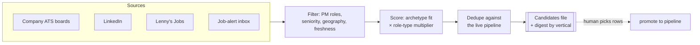

# JobHunter

**Type:** Automated Python Workflow
**Skill Domain:** CareerOS
**Command:** `python main.py hunt` · `python main.py sweep`

## What It Does

Discovers PM roles across four sources, scores them for fit, dedupes them against everything I've already applied to — and then **stops and shows me the list**. Nothing reaches my pipeline until I say which rows to promote.

## Review-first, by design

The obvious version of this tool writes straight to Notion. Mine deliberately doesn't.

High-volume sourcing plus automatic writes produces a pipeline full of half-relevant rows, and a pipeline you don't trust is worse than no pipeline. So a hunt saves a **candidates file** and prints a digest grouped by vertical. Promotion to the Applications database is a separate, explicit command naming the rows I picked.



## How It Works

1. **Discovery** — sweeps company ATS boards, LinkedIn, Lenny's Jobs, and parsed job-alert email
2. **Filtering** — PM roles at the right seniority, inside the target geography, weighted toward freshly-posted listings
3. **Scoring** — company archetype fit combined with a **role-type multiplier** that weights each opportunity by how well the archetype matches my background
4. **Deduping** — drops roles already in the pipeline and caps applications per company, so one company can't flood a sweep
5. **Review** — writes a candidates file and prints a digest grouped by vertical, best-fit companies first
6. **Promotion** — a separate command commits only the rows I name, linking each to its Companies entry

## Role-type multipliers

Every role is classified into an archetype, and each archetype carries a weight reflecting where I actually convert. Ads and marketplace roles score highest — that's where my deepest experience is. Platform and infrastructure roles score lowest, and the materials workflow refuses to generate for them at all.

Getting this classification right matters more than it looks. A single missed keyword in the classifier silently mislabels a role, and a mislabelled role is derated in *every* downstream scorer — it doesn't error, it just quietly ranks lower. One recent example: requisitions titled *"Product Founder"* were falling through to the generic consumer bucket because the classifier matched `founding` but not `founder`. Founder roles are among my strongest fits and were being scored as my most average ones.

## Design Decisions

- **Why review-first instead of auto-writing?** A pipeline is a decision record. Automatic writes turn it into a scratchpad, and downstream workflows that read it start tailoring against noise.
- **Why four sources instead of one?** Each has a different blind spot — boards miss early postings, LinkedIn hides behind auth, aggregators lag. Overlap is the point.
- **Why freshness is first-class:** applying early to a newly-posted role meaningfully outperforms applying late, so recency is a ranking signal rather than a filter.
- **Why cap applications per company?** Three applications to one company reads as spray. One well-matched application plus a warm path converts far better.
- **Why a digest by vertical instead of a flat list?** Grouping surfaces the question that actually matters — *which company is worth the effort today* — instead of a ranked wall of titles.

## Architecture

```
job_hunter/
├── job_hunter.py            # Main orchestrator
├── expertise_filter.py      # Role relevance and seniority filtering
├── archetype_scorer.py      # Company-fit scoring
├── linkedin_job_search.py   # LinkedIn discovery
└── scrapers/                # Per-ATS career page parsers
```

Role-type classification lives in a shared utility, so sourcing, scoring, and the materials workflow all read the same archetype for a given role.

## Output

A candidates file plus a printed digest. Each candidate carries:

- Company and role title, with a direct permalink to the posting
- Location and posting recency
- Fit score, with the archetype and multiplier that produced it
- Duplicate status against the live pipeline

Promoted rows land in the Applications database, linked to their Companies entry.

## Prompt File

→ [`prompt.md`](./prompt.md) — routing definition and filtering criteria
